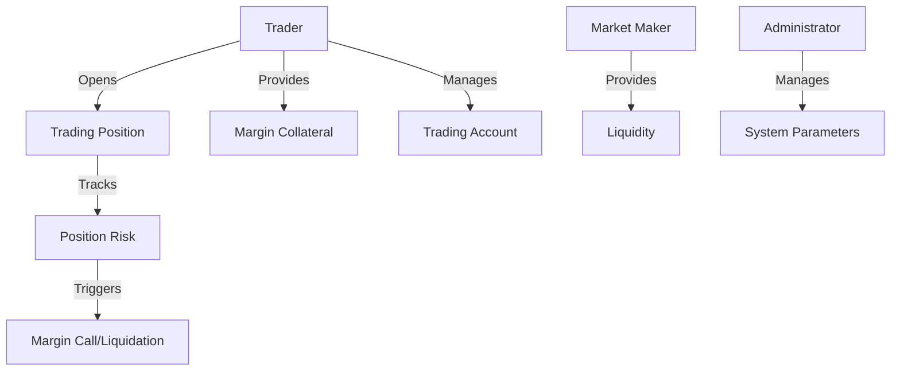

# Broadcast Margin: Decentralized Margin Trading

A blockchain-powered margin trading platform on the Stacks network that enables secure, transparent, and flexible leveraged trading with advanced risk management.

## Overview

Broadcast Margin is a decentralized margin trading infrastructure that provides traders with sophisticated trading capabilities, robust risk controls, and transparent position management. By leveraging blockchain technology, we create a trustless environment for complex financial instruments.

### Key Features

- Flexible margin trading with configurable leverage
- Real-time position risk assessment
- Market maker integrations
- Transparent liquidation mechanisms
- Comprehensive trader verification
- Immutable trading records

## Architecture

The system is built around a core smart contract that manages traders, positions, margin requirements, and trading operations. The architecture follows a role-based access model with three primary actors: traders, market makers, and administrators.



### Core Components

1. **User Management**
   - Trader registration
   - Market maker verification
   - Account status tracking

2. **Position Management**
   - Margin position creation
   - Leverage configuration
   - Risk monitoring

3. **Trading Infrastructure**
   - Margin calculation
   - Liquidation mechanisms
   - Position tracking

4. **Risk Control**
   - Automated margin calls
   - Liquidation threshold management
   - Position health monitoring

## Getting Started

### Prerequisites

- Clarinet CLI
- Stacks wallet
- Node.js development environment

### Installation

1. Clone the repository
```bash
git clone <repository-url>
cd broadcast-margin
```

2. Install dependencies
```bash
clarinet install
```

3. Run tests
```bash
clarinet test
```

## Contract Documentation

### Margin Trading Contract

The primary contract (`margin-trading.clar`) handles core trading functionality.

#### Key Functions

**Trader Operations**
- `open-position`: Create a new margin trading position
- `close-position`: Close an existing trading position
- `deposit-margin`: Add funds to trading account
- `withdraw-margin`: Remove available funds

**Market Maker Operations**
- `provide-liquidity`: Add liquidity to trading pools
- `update-market-parameters`: Adjust trading parameters

**Administrative Operations**
- `set-admin`: Change contract administrator
- `update-liquidation-rules`: Modify system-wide liquidation parameters

## Development

### Testing Strategy

Comprehensive test scenarios cover:
1. Position opening and closing
2. Margin calculation
3. Liquidation mechanisms
4. Risk assessment
5. User role management

## Security Considerations

### Risk Management
- Automated margin call system
- Configurable liquidation thresholds
- Transparent position tracking

### Access Control
- Strict role-based permissions
- Verified trader accounts
- Administrative oversight

### Known Limitations
- Maximum leverage limits
- Liquidity-dependent trading
- Market volatility risks

## License

[Specify your license here]